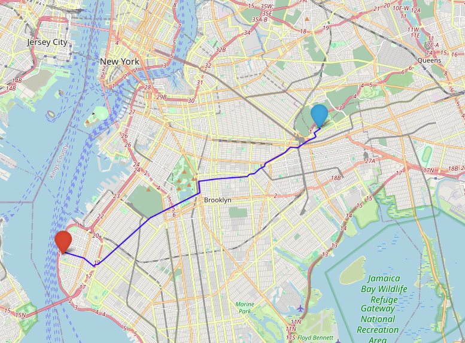
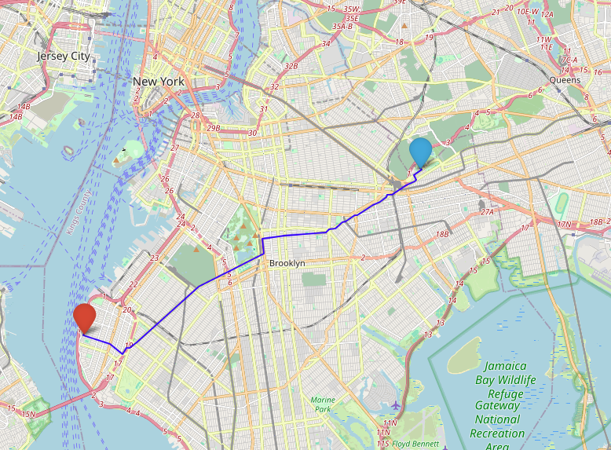

## astar-real-road-network
A* algorithm for real road networks.
### Dataset
It uses New York City's actual road network.
The data comes from [1].
- There are 96,570 nodes.
- There are 260,855 links.
### Problem formulation
This algorithm generates a path considering three metrics.
- Street length (meters): There are pre-calculated street lengths from [1]. The heuristic function for distance metric uses Haversine distance.
- Travel time (seconds): It is calculated by dividing the distance by the speed limit from [3]; see [4] for more details. The heuristic function for this uses Haversine distance divided by New York City's maximum speed limit.
- Carbon emission (g/m): It can be estimated based on elevation, speed, and acceleration as driving from the equation in [2]. <ins>The algorithm assumes all vehicles drive at the speed limit (i.e., a=0).</ins> The heuristic function for this is simply the minimum emissions.  
$$f_t = \beta_1 \cos\theta + \beta_2 v \sin\theta + \beta_3 v^2 + \beta_4 a + \beta_5 \frac{a}{v} + \beta_6 \frac{1}{v} + \beta_7$$
$$E_{CO_2} = 2.32 \times f_t$$

The cost function of a path is a linear combination of three metrics, with adjustable weights.
$$\text{cost} = \alpha \cdot \text{street length} + \beta \cdot \text{travel time} + \gamma \cdot \text{carbon emission}$$
That is, setting $\alpha=1, \beta=0$ and $\gamma=0$ calculates the shortest path; $\alpha=0, \beta=1$ and $\gamma=0$ yields the fastest path; and $\alpha=0, \beta=0$ and $\gamma=1$ determines the most eco-friendly path.
### Python modules
pybind11 is a header-only library facilitating seamless C++ and Python interoperability with minimal code, making it straightforward to expose C++ functions and classes to Python.
#### Install pybind11
Using APT,
```bash
sudo apt update
sudo apt install pybind11-dev
```
#### Compile
```bash
c++ -O3 -Wall -shared -std=c++11 -fPIC $(python3 -m pybind11 --includes) astar.h astar.cpp planner.cpp -o planner.so
```
### Run demo code
If you want to get the optimal cost,
```python
python3 main.py -f ${start_latitude} ${start_longitude} -t ${end_latitude} ${end_longitude} -w ${alpha} ${beta} ${gamma} -s 1
```
For example,
```python3
python3 main.py -f 40.6652 -73.9182 -t 40.6291 -74.0385 -w 1 0 0 -s 1
```
If you want to get the optimal path, it is saved in `./result/optimal_path.csv`.
```python
python3 main.py -f ${start_latitude} ${start_longitude} -t ${end_latitude} ${end_longitude} -w ${alpha} ${beta} ${gamma} -s 0
```
If you want to get the shortest path,
```python
python3 main.py -f ${start_latitude} ${start_longitude} -t ${end_latitude} ${end_longitude} -w 1 0 0 -s ${save_or_not}
```
If you want to get the fatest path,
```python
python3 main.py -f ${start_latitude} ${start_longitude} -t ${end_latitude} ${end_longitude} -w 0 1 0 -s ${save_or_not}
```
If you want to get the eco-friendly path,
```python
python3 main.py -f ${start_latitude} ${start_longitude} -t ${end_latitude} ${end_longitude} -w 0 0 1 -s ${save_or_not}
```
### Visualization
#### Example 1. From (40.6652, -73.9182) to (40.6291, -74.0385)
  

#### Example 2. 

#### Example 3.

#### Example 4. 
From the left, the shortest path, the fatest path, and the most eco-friendly path.

### References
[1] Donovan, Brian; Work, Dan (2016): New York City Taxi Trip Data (2010-2013). University of Illinois at Urbana-Champaign. https://doi.org/10.13012/J8PN93H8  
[2] Weiliang Zeng, Tomio Miwa, Takayuki Morikawa,
Prediction of vehicle CO2 emission and its application to eco-routing navigation, Transportation Research Part C: Emerging Technologies,
Volume 68, 2016, Pages 194-214. https://doi.org/10.1016/j.trc.2016.04.007  
[3] https://data.cityofnewyork.us/Transportation/VZV_Speed-Limits/7n5j-865y  
[4] https://github.com/2jungeuni/preprocessing-for-routing